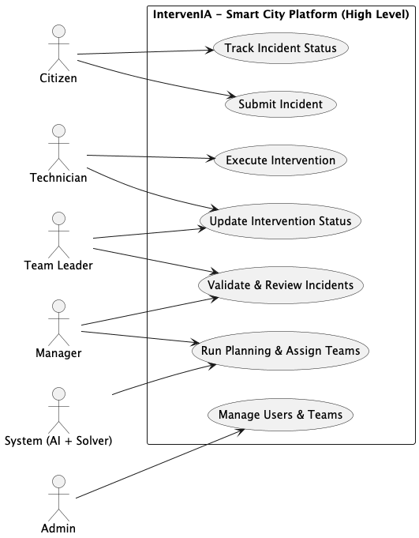
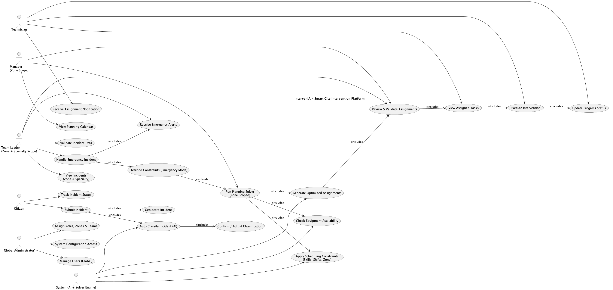
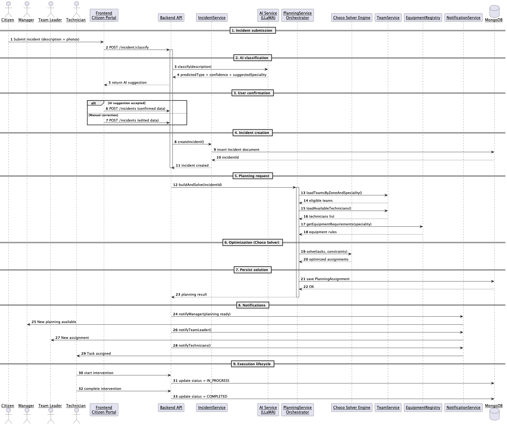
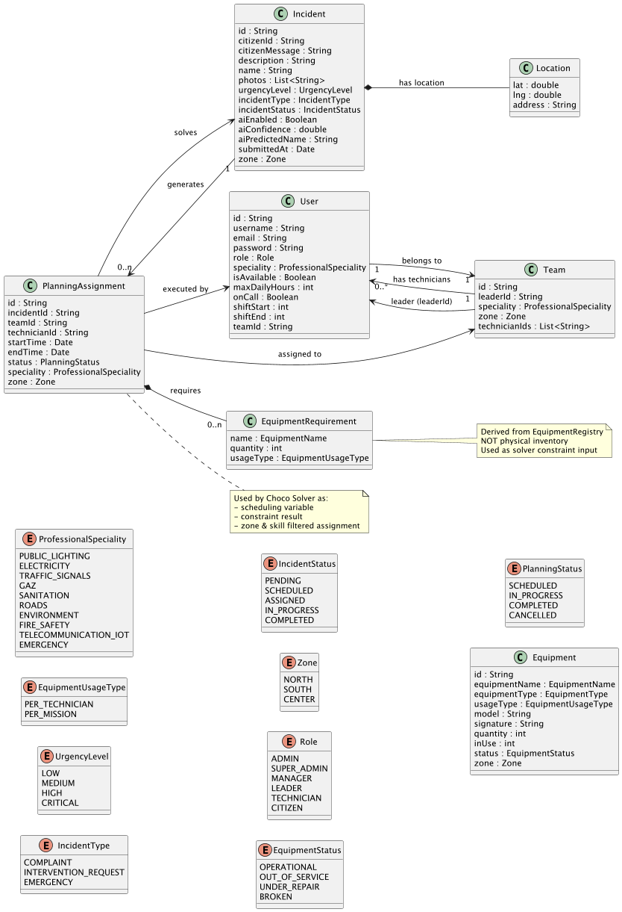
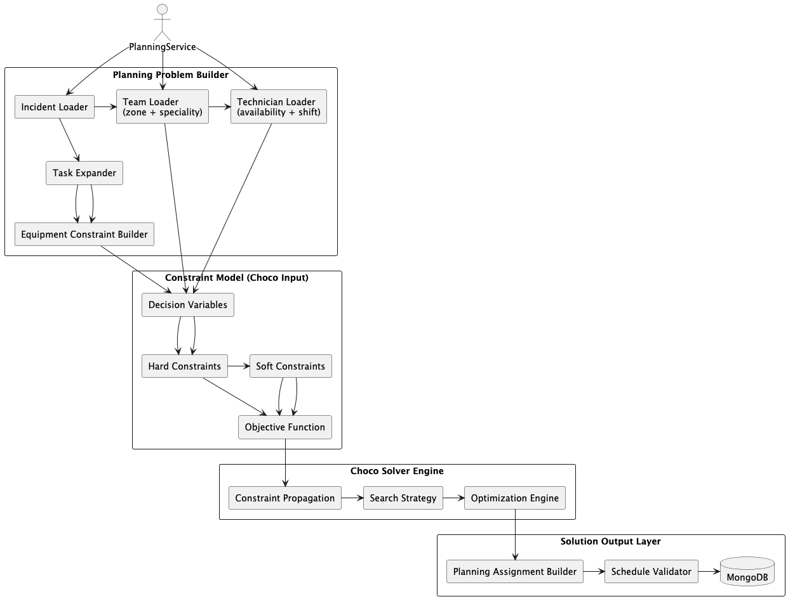
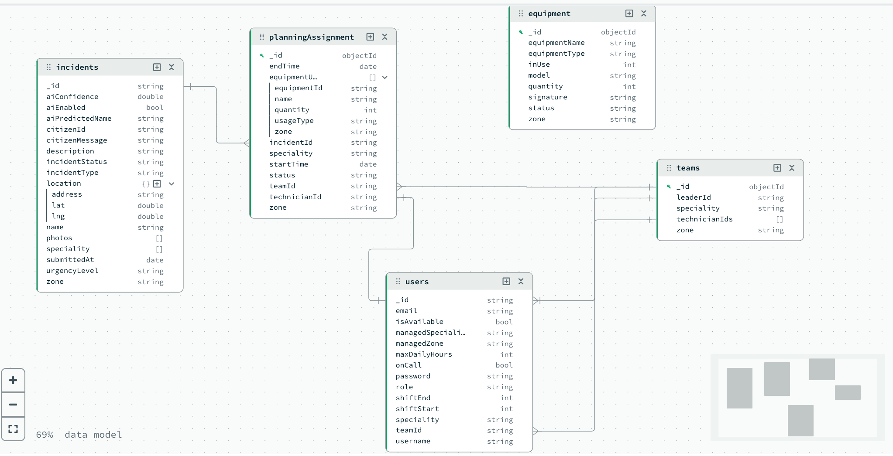

# Intervenia

Intervenia is an intelligent urban incident management and intervention planning platform. It combines AI-powered classification with constraint-based optimization to automate how city services respond to incidents.

The system is designed as a **decision-support and automation platform** for smart cities, enabling efficient allocation of human and material resources.

## 🎥 Demo Video

A short demonstration of the system in action:

👉 https://share.descript.com/view/mv0B2tld9AH

---

## 🚀 Tech Stack

**Backend**

* Java 17
* Spring Boot
* Spring Data MongoDB
* Spring Security (JWT)
* Choco Solver (constraint programming)

**Frontend**

* Next.js (React)
* Tailwind CSS

**Database**

* MongoDB (NoSQL)

**AI Layer**

* LLM-based classification service

---

## 🧠 Core Features

* AI-assisted incident classification
* Zone-based resource management
* Constraint-based planning (Choco Solver)
* Equipment-aware scheduling
* Role-based dashboards
* Real-time intervention lifecycle tracking

---

## 👥 User Roles & Privileges


### 🟢 Citizen

* Submit incidents (description, images, location)
* Receive AI suggestions (type, urgency, speciality)
* Confirm or edit incident before submission

---

### 🔵 Zone_Manager

* Manages **ONE specific zone**
* Can:

    * View incidents in their zone
    * View teams, leaders, and technicians in their zone
    * Run **weekly planning solver ONLY for their zone**
* Cannot access other zones

---

### 🟣 Team Leader

* Leads a team within a zone
* Receives assignments from planning
* Monitors team execution
* Coordinates technicians

---

### 🟠 Technician

* Assigned to a team
* Executes interventions
* Has:

    * `speciality`
    * `shiftStart / shiftEnd`
    * `maxDailyHours`
    * `onCall` (for emergencies)
    * `isAvailable`

The full diagram is available in:

/docs/engineer_Level_Use_Case_Diagram.puml

and exported version:

/docs/diagrams_photos/high_Level_Use_Case_Diagram.png

---

### 🔴 Global Administrator

* Full system access
* Manages users, teams, equipment, and system configuration

---
Engineer level use case diagram:



The full diagram is available in:

/docs/engineer_Level_Use_Case_Diagram.puml

and exported version:

/docs/diagrams_photos/engineer_level_usecases.png

---

## ⚙️ System Architecture

Intervenia follows a **modular, domain-driven architecture**:

### Backend (Spring Boot)

* REST APIs
* Domain services
* Planning engine (Choco Solver)
* Equipment management
* AI integration

### Frontend (Next.js)

* Citizen portal
* Manager dashboard
* Admin panel

### External Services

* AI classification service
* Notification service


---

## 🔄 End-to-End Workflow

1. **Incident Submission**

    * Citizen submits description, images, location

2. **AI Classification**

    * Predicts:

        * Incident type
        * Urgency level
        * Required speciality

3. **User Validation**

    * Citizen confirms or edits AI result

4. **Incident Storage**

    * Saved in MongoDB

5. **Planning (Core Intelligence)**

   The solver:

    * Filters incidents by **zone**
    * Expands tasks
    * Validates equipment availability
    * Assigns technicians

6. **Notifications**

    * Manager, team leader, technicians notified

7. **Execution**

    * Status progresses:

        * PENDING → IN_PROGRESS → DONE


The full diagram is available in:

/docs/sequence_diagram.puml

and exported version:

/docs/diagrams_photos/sequence-Diagram.png

---
🧩 Class Diagram Overview




The Class Diagram represents the core domain model of IntervenIA and how entities interact within the system. It is designed using a hybrid DDD-inspired structure adapted to a MongoDB-based architecture.

* Main Purpose

It provides a static view of the system, focusing on:

Core business entities (User, Team, Incident, Equipment, PlanningAssignment)
Relationships between domain objects
System constraints (roles, zones, specialities, statuses)
Data structure used by the planning and solver engine.

Key Design Principles
  * User-Centric Model: Users are central and linked to teams, roles, and operational constraints
  * Zone-Based Organization: Most entities are scoped by Zone to support regional planning isolation
  * Speciality-Driven Assignment: Teams and technicians are matched based on ProfessionalSpeciality
  * Hybrid Data Modeling:
  * Embedded structures for execution-time data (e.g., equipment usage in planning)
  * Referenced entities for core domain objects (users, teams, incidents)
 
* Solver Integration

The class model directly feeds the Choco Solver engine by transforming:

Incidents → PlanningTasks
Users → PlanningTechnicians
Equipment rules → Constraint inputs

This ensures the solver operates on a clean, optimized, and pre-filtered domain snapshot.

* Location in Repository

The full diagram is available in:

/docs/class-diagram.puml

and exported version:

/docs/diagrams_photos/class-diagram.png

## 🧠 Planning Engine (Choco Solver)

### 🎯 Objective

Minimize total intervention start time (respond as early as possible)

---

### ✅ Constraints

#### 1. Technician Assignment

A technician can be assigned only if:

* `isAvailable == true`
* Same `zone` as task
* Same `speciality`
* Does not exceed:

  ```
  weeklyHoursAssigned ≤ maxDailyHours × 7
  ```

---

#### 2. Time Windows

Each task must satisfy:

* `start >= earliestStart`
* `start <= deadline`

---

#### 3. Shift Constraints

* Tasks must fit inside technician working hours
* Supports:

    * Day shifts (e.g., 07 → 15)
    * Night shifts (20 → 04)
* Special handling for night wrap-around

---

#### 4. On-Call Logic (Critical Emergencies)

* On-call technicians can work during off ساعات (04 → 07)
* Only for:

    * `IncidentType = EMERGENCY`
    * `Urgency = CRITICAL`

---

#### 5. No Overlapping Tasks

A technician cannot handle overlapping tasks:

```
taskA ends before taskB OR taskB ends before taskA
```

---

#### 6. Equipment Constraints (Pre-Solver Validation)

Equipment is validated BEFORE solving.

### 🧰 Equipment Logic

* Equipment is stored by:

    * `zone`
    * `name`
    * `status`

* Requirements come from **EquipmentRegistry**

Each requirement has:

* `name`
* `quantity`
* `usageType`

---

### ⚡ Usage Types

#### PER_TECHNICIAN

```
required = quantity × number_of_technicians
```

Examples:

* Gloves
* Radios
* Safety gear

---

#### PER_MISSION

```
required = quantity
```

Examples:

* Truck
* Generator
* Heavy machinery

---

### ✅ Validation Algorithm

1. Get requirements from registry (based on speciality)
2. Aggregate total required equipment per type
3. Query DB:

   ```
   findByZoneAndNameAndStatus(zone, name, OPERATIONAL)
   ```
4. Compare:

   ```
   available >= required
   ```
5. If not → incident is skipped

The full diagram is available in:

/docs/solver_Architecture.puml

and exported version:

/docs/diagrams_photos/Solver_Architecture___Snake_Flow.png

---

## 🗄️ Data Modeling Strategy

Intervenia uses a **hybrid NoSQL approach**:



### ✅ Embedding (for performance)

Example:

```
PlanningAssignment → EquipmentRequirement[]
```

### ✅ Referencing (for scalability)

* User → Team
* Assignment → Incident
* Assignment → Technician

---

## Core Collections

* `users`
* `teams`
* `incidents`
* `equipment`
* `planningAssignments`


The diagram photo is available in:

docs/diagrams_photos/data_model.png

---

## 📁 Project Structure

```
/frontend        → Next.js app
/src             → Spring Boot backend
```

---

## ▶️ Getting Started

### Backend

```
./mvnw spring-boot:run
```

### Frontend

```
cd frontend
npm install
npm run dev
```

---

## 🔮 Future Improvements

* More refined and optimized Zone-restricted solver execution per manager  (currently)
* Dynamic re-planning (real-time incidents)
* Real time notifications (n8n)
* Handle user app feedback
* Auto generate reports and analysis
* Multi-city scaling

---

## 🧠 Key Design Insight

Intervenia separates:

* **Domain Logic** → EquipmentRegistry (rules)
* **Persistence** → MongoDB (resources)
* **Optimization** → Choco Solver (decisions)

This separation ensures:

* Maintainability
* Scalability
* Real-world modeling accuracy

---

## 📜 License

Currently unlicensed. Consider adding MIT or Apache-2.0.
