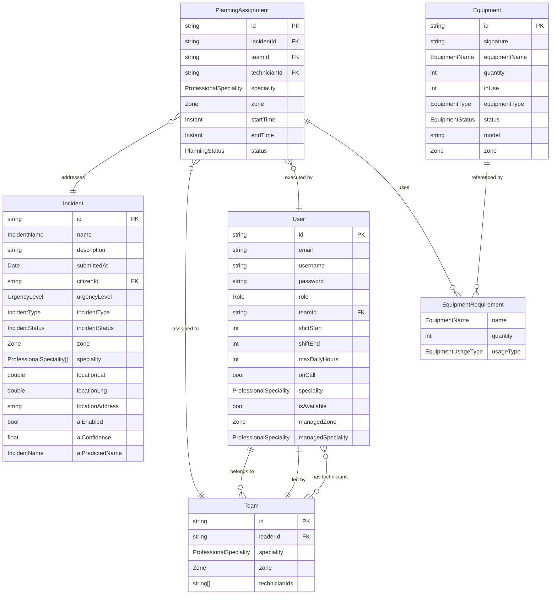

# Intervenia

Intervenia is an intelligent urban incident management and intervention planning platform. It combines AI-powered classification with constraint-based optimization to automate and improve how city services respond to incidents.

The system is built as a full-stack application using a modern architecture:

Backend: Spring Boot (Java 17)
Frontend: Next.js (React)
Database: MongoDB (NoSQL)
Optimization Engine: Choco Solver
AI Layer: LLM-based classification service

## Table of Contents


## Overview
Intervenia enables municipalities or organizations to:

Collect incident reports from citizens
Automatically classify incidents using AI
Assign the most suitable teams and technicians
Optimize scheduling based on constraints (availability, skills, location, equipment)
Notify stakeholders and track execution

The platform significantly improves:

⏱ Response time
⚙️ Resource utilization
📊 Operational efficiency

## System architecture
Intervenia follows a modular service-oriented architecture:

🔹 Backend (Spring Boot)
REST APIs (Spring Web)
Business logic & domain services
Optimization engine integration (Choco Solver)
AI integration (classification service)
MongoDB persistence layer

🔹 Frontend (Next.js)
Citizen portal (incident reporting)
Admin dashboards (teams, planning, monitoring)
API consumption via REST

🔹 External/Supporting Components
AI Service (LLM-based classification)
Notification Service (emails / alerts)
MongoDB database


The backend is designed around:

Domain-driven structure
Service layer separation
Stateless APIs
Event-like workflow (incident lifecycle)

### End to end workflow


The system follows a fully automated pipeline:

🟢 Step 1 — Incident Submission
A citizen submits:
Description
Photos
Request → Backend API
🟡 Step 2 — AI Classification
AI analyzes the description:
Predicts incident type
Estimates urgency level
Suggests required specialty
Returns:
aiPredictedName
aiConfidence
Guidance message
🔵 Step 3 — User Validation
Citizen:
Confirms AI suggestion
OR
Manually adjusts information

🟣 Step 4 — Incident Creation
Backend stores the incident in MongoDB
Incident becomes a planning input

🔴 Step 5 — Auto Planning (Core Intelligence)

The planning engine:

Finds eligible teams
Filters available technicians
Checks equipment availability
Solves constraints using Choco Solver

Constraints include:

Technician skills
Working hours
Geographic zone
Equipment availability

👉 Output:
Optimized PlanningAssignment

🟠 Step 6 — Notifications
Manager notified
Team leader notified
Technicians assigned

⚫ Step 7 — Execution
Intervention starts
Status updated (e.g., IN_PROGRESS, DONE)

#### Data modeling

Core Collections:
  incidents
  users
  teams
  equipment
  planningAssignments

Strategy: Embedding vs Referencing:
  One of the most important design decisions in this project was transitioning from a relational UML class diagram to a NoSQL document model.

  From UML to MongoDB
  
  In the original class diagram:
  
  Entities were strongly normalized
  Relationships were explicit (FKs)
  
  In MongoDB:
  
  We redesigned the model to balance:
  Performance ⚡
  Flexibility 🔄
  Scalability 📈

          📌 When We Use Embedding?
          
          We embed data when:
          
          It is tightly coupled
          It is read together frequently
          It has limited size and growth
          ✅ Example: Equipment inside PlanningAssignment
          equipment: [
          {
          equipmentId,
          name,
          quantity,
          usageType,
          zone
          }
          ]
          
          👉 Why?
          
          Equipment requirements are specific to the assignment
          Avoids joins during planning execution
          Improves read performance


          When We Use Referencing (by ID)
          
          We use references when:
          
          Data is shared across multiple entities
          It changes frequently
          It can grow large
          ✅ Examples:
          1. Incident → PlanningAssignment
             incidentId
             2. Team → Users
                teamId
                technicianIds[]
             3. PlanningAssignment → Technician
                technicianId

Key Design Insight:

👉 Intervenia uses a hybrid approach:

Embedding for execution context (planning snapshot)
Referencing for core entities (users, teams, incidents)

This ensures:

🚀 Fast planning execution
🔄 Independent updates of core entities
📈 Scalability for large systems




#### Tech Stack
  Backend
    Java 17
    Spring Boot
    Spring Data MongoDB
    Spring Security (JWT)
    Choco Solver
    OpenAPI / Swagger
    Actuator
  Frontend
    Next.js 16
    React 19
    Tailwind CSS
    Radix UI
  Database
    MongoDB

#### Monorepo Structure
```
/ (project root)
├─ frontend/                 # Next.js app
├─ src/                      # Spring Boot backend source
├─ pom.xml                   # Maven project
├─ mvnw, mvnw.cmd            # Maven wrapper
├─ qodana.yaml               # Static analysis config (JetBrains)
└─ target/                   # Maven build outputs (generated)
```

## Prerequisites
- Java 17+
- Maven 3.9+
- Node.js 18+ (recommended 20+)
- npm 9+ or pnpm/yarn
- MongoDB 6+ (remote connection)

## Getting Started
1) Backend (Spring Boot)
From the project root:
```
# Install dependencies and start the backend
./mvnw spring-boot:run
```
By default the app runs on http://localhost:8080.

Run tests:
```
./mvnw test
```
Build an executable jar:
```
./mvnw -DskipTests package
# Jar will be in target/ (e.g., target/intervenia-0.0.1-SNAPSHOT.jar)
```

2) Frontend (Next.js)
From the project root:
```
cd frontend
npm install
npm run dev
```
The frontend starts on http://localhost:3000.

For a production build:
```
npm run build
npm start
```

### Configuration
#### Backend configuration
Spring Boot reads configuration from `application.properties` or `application.yml`. Typical settings:
```
spring.data.mongodb.uri=mongodb://localhost:27017/intervenia
server.port=8080
# JWT/crypto related settings (example)
app.security.jwt.secret=change-me
app.security.jwt.expiration=3600000
# Springdoc OpenAPI
springdoc.api-docs.enabled=true
springdoc.swagger-ui.enabled=true
```
Environment variables can override properties (e.g., `SPRING_DATA_MONGODB_URI`).

#### Frontend configuration
Create `frontend/.env.local` to point the app to the backend:
```
NEXT_PUBLIC_API_BASE_URL=http://localhost:8080
```
Use `NEXT_PUBLIC_` prefix for any variable needed in the browser.

#### API Documentation
With Springdoc (version 2.x), OpenAPI endpoints are available at:
- JSON: `http://localhost:8080/v3/api-docs`
- Swagger UI: `http://localhost:8080/swagger-ui/index.html`

#### Example API Endpoints
The `UserController` exposes basic CRUD and query endpoints under `/api/users`:
- `POST /api/users` — create a user
- `GET /api/users/{id}` — get a user by ID
- `GET /api/users` — list users
- `GET /api/users/team/{id}` — list users by team ID
- `GET /api/users/role/{role}` — list users by role
- `GET /api/users/speciality/{speciality}` — list users by professional speciality
- `GET /api/users/email/{email}` — find user by email
- `PUT /api/users/{id}` — update user
- `DELETE /api/users/{id}` — delete user
- `PUT /api/users/{onCall}/{id}` — update on‑call status for a user
- `PUT /api/users/{shiftStart}/{shiftEnd}/{id}` — update user shift hours

Note: Endpoint paths above are derived from the source and may be subject to change if controllers evolve.

Other notable backend areas (examples based on repository structure):
- Equipment domain and services: `tn.intervent360.intervent360.domain.model.equipment.*`, `application.service.equipment.EquipmentService`
- Teams and embeddings: `application.service.team.TeamEmbeddingService`
- Password utilities/migration: `application.service.PasswordMigrationService`

#### Development Tips
- CORS: The backend enables `@CrossOrigin(origins = "*")` on controllers like `UserController`. Adjust for production.
- Validation: Use Spring Validation annotations in DTOs; violations return 400 responses.
- MongoDB: Ensure your local MongoDB is running and the configured database exists or can be created.
- Actuator: Access health/metrics at `/actuator` (secure appropriately in production).

#### Build for Production
- Backend: `./mvnw -DskipTests clean package` then run `java -jar target/intervenia-0.0.1-SNAPSHOT.jar` with proper environment variables.
- Frontend: `npm run build && npm start` in `frontend/`. Configure a reverse proxy (e.g., Nginx) or a PaaS runtime. Ensure `NEXT_PUBLIC_API_BASE_URL` points to the deployed backend.

#### Quality & Linting
- Frontend: `npm run lint`
- Backend: Use your IDE static analysis; project includes `qodana.yaml` for JetBrains Qodana.

#### Troubleshooting
- Port conflicts: Change `server.port` (backend) or pass `-p 3001`/`PORT=3001` for Next.js.
- MongoDB connection errors: Verify `spring.data.mongodb.uri` and that MongoDB is running and accessible.
- Swagger UI not found: Confirm Springdoc starter is present and endpoints are enabled (`/swagger-ui/index.html`).

#### Future Improvements
Automatic re-planning (dynamic incidents)
Intervention history tracking
Real-time monitoring dashboard
Advanced AI recommendations
Multi-city scalability

#### Contributing
1. Fork the repo and create a feature branch.
2. Follow existing code style and conventions.
3. Add/update documentation and tests where applicable.
4. Open a pull request with a clear description.

#### License
This project is currently unlicensed. If you plan to use it publicly, consider adding a suitable open‑source license (e.g., MIT, Apache‑2.0).